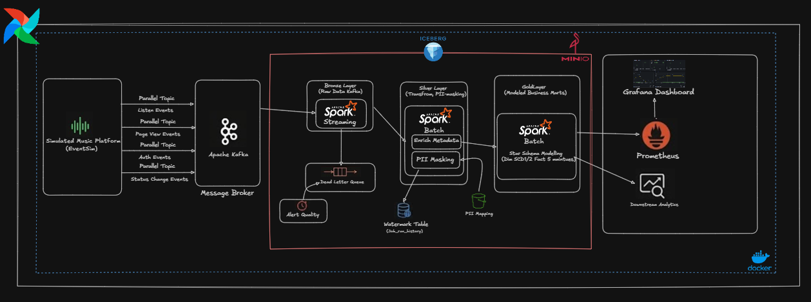
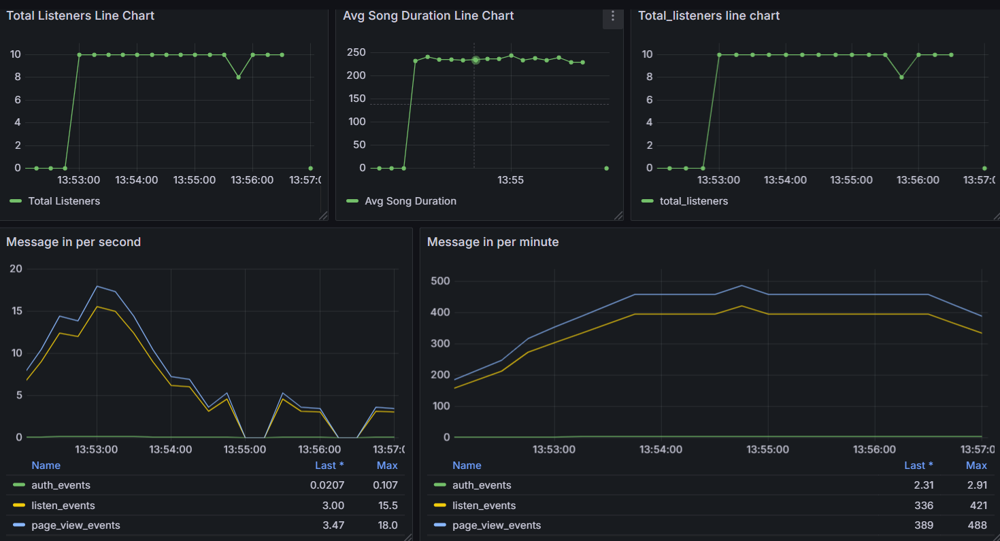

# 🎵 Music Streaming Data Pipeline (End-to-End)

> A production-grade, real-time data pipeline that ingests, processes, and serves streaming analytics from a simulated music platform — built entirely on open-source technologies and containerized with Docker Compose.

---

## Tech Stack

| Layer | Technology | Version | Role |
|:------|:-----------|:--------|:-----|
| **Data Generation** | Eventsim | — | Sinh dữ liệu giả lập hành vi người dùng (listen, page view, auth, status change) trên 4 Kafka topic song song |
| **Message Broker** | Apache Kafka (KRaft) | 4.0.0 | Tiếp nhận và phân phối dữ liệu streaming real-time, chạy KRaft mode (không cần Zookeeper) |
| **Stream & Batch Processing** | Apache Spark (PySpark) | 3.5.6 | Xử lý cả Structured Streaming (Bronze) và Batch Processing (Silver → Gold) |
| **Table Format** | Apache Iceberg | — | Open table format hỗ trợ ACID transactions, Time Travel, Schema Evolution, và Partition Evolution |
| **Object Storage / Data Lake** | MinIO | latest | S3-compatible storage, thay thế AWS S3 cho môi trường local |
| **Metadata Catalog** | Hive Metastore + PostgreSQL | 16-alpine | Quản lý metadata cho tất cả Iceberg tables trên MinIO |
| **Orchestration** | Apache Airflow (CeleryExecutor) | 2.10.5 | Lập lịch và điều phối các batch job, hỗ trợ phân tán qua Celery + Redis |
| **Task Queue** | Redis | 7-alpine | Message broker cho Airflow CeleryExecutor |
| **Monitoring** | Prometheus + Grafana | v2.54.1 / 11.3.0 | Thu thập và trực quan hóa metrics hệ thống + business KPIs |
| **Kafka Monitoring** | Kafka UI + Kafka Exporter | v0.7.2 | Giao diện quản trị topic, consumer group, và xuất metrics ra Prometheus |
| **Celery Monitoring** | Flower | — | Dashboard theo dõi trạng thái và hiệu suất Airflow workers |
| **Language** | Python (PySpark) | 3.x | Ngôn ngữ chính cho toàn bộ ETL jobs |
| **Infrastructure** | Docker Compose | — | Triển khai toàn bộ 15+ services bằng một lệnh duy nhất |

---

## Kiến trúc Hệ thống



---

## Tính năng nổi bật

### 🏗️ Medallion Architecture (Bronze → Silver → Gold)
Dữ liệu được xử lý qua 3 lớp chất lượng tăng dần, lưu trữ trên MinIO dưới định dạng Apache Iceberg:
- **Bronze**: Dữ liệu thô từ Kafka, lưu nguyên bản dạng Iceberg table với Structured Streaming (`foreachBatch`).
- **Silver**: Dữ liệu đã được deduplicate (theo `kafka_partition` + `kafka_offset`), chuẩn hóa timestamp, masking PII, và enriching metadata.
- **Gold**: Star Schema gồm Dimension tables (SCD Type 1 & 2) và Fact tables (Micro-batch 5 phút).

### 🔐 GDPR-Compliant PII Masking
- **Pseudonymization**: `userId` → `user_pseudo_id` (SHA-256 + salt) để chống Rainbow Table attack.
- **Data Minimization**: Xóa vĩnh viễn `firstName`, `lastName` khỏi Silver layer.
- **Generalization**: `zip` → giữ 3 ký tự đầu + `**`; `lon`/`lat` → làm tròn 1 chữ số thập phân.
- **Secure PII Vault**: Bảng `pii_mapping` lưu mapping ngược (chỉ admin được truy cập), cho phép tuân thủ quyền "Right to be Forgotten" của GDPR.

### 🛡️ Dead Letter Queue (DLQ) Pattern
- JSON parsing lỗi từ Kafka được tách riêng vào bảng `dlq_{topic_name}` thay vì làm crash pipeline.
- Job `dlq_monitoring.py` quét định kỳ, tính tỷ lệ lỗi (%) và kích hoạt cảnh báo khi vượt ngưỡng.

### ⏱️ Incremental Processing với Watermark Table
- Mỗi Spark job ghi lại `max_timestamp` của lần chạy thành công gần nhất vào bảng Iceberg `metadata.job_run_history`.
- Lần chạy tiếp theo chỉ xử lý dữ liệu **mới hơn** mốc đó → Không xử lý trùng lặp, tiết kiệm tài nguyên.
- Hỗ trợ Backfill tự nhiên: Nếu pipeline chết 3 ngày, khi bật lại nó sẽ tự động xử lý toàn bộ dữ liệu tích lũy.

### 📊 Real-time Metrics Pipeline
- Job `stream_metrics.py` chạy Structured Streaming liên tục, tính toán KPI theo cửa sổ trượt 5 phút:
  - Active Listeners, Paid Users Ratio, Average Song Duration, Total Songs Played.
- Đẩy metrics trực tiếp lên **Prometheus** qua `prometheus_client` Python library → Hiển thị trên Grafana dashboard.



### ⭐ Star Schema (Dimensional Modeling) ở Gold Layer
- **`dim_user` (SCD Type 2)**: Lưu toàn bộ lịch sử thay đổi gói cước (Free ↔ Paid) của từng user, sử dụng `MERGE INTO` của Iceberg.
- **`dim_song` (SCD Type 1)**: Danh mục bài hát chuẩn hóa, song_id = MD5 hash của `artist||song`.
- **`fact_user_activity_5min`**: Theo dõi hành vi từng user mỗi 5 phút (FULL OUTER JOIN giữa `listen_events` và `page_view_events`).
- **`fact_platform_health_5min`**: KPI sức khỏe nền tảng (Active Users, Paid/Free ratio, Error rate).
- **`fact_top_content_5min`**: Bảng xếp hạng bài hát Trending theo cửa sổ 5 phút.

### 🔄 Dual-Cadence Scheduling
- **Dimension tables**: Chạy 1 giờ/lần (SCD2 `MERGE INTO` tốn tài nguyên, user hiếm khi đổi gói cước liên tục).
- **Fact tables**: Chạy 5 phút/lần (chỉ `groupBy` + `append`, cực nhẹ, phù hợp dashboard real-time).
- Hai DAG Airflow **tách biệt hoàn toàn** → Dim lỗi không kéo theo Fact bị dừng.

### 🏥 Data Quality Checks
- **Pre-Gold DQ** (`silver_dq_checks.py`): Kiểm tra số lượng bản ghi tối thiểu và tỷ lệ Null trên cột `user_pseudo_id` trước khi cho phép Gold layer chạy.
- Nếu DQ check thất bại → `sys.exit(1)` → Airflow đánh dấu task FAILED → Toàn bộ downstream tasks bị chặn.

### 🐳 Fully Containerized (15+ Services)
Toàn bộ hạ tầng chạy bằng một lệnh `docker-compose up -d`:

```
Kafka (KRaft) → Eventsim → Spark Master + Worker → MinIO → Hive Metastore
→ PostgreSQL → Airflow (Webserver + Scheduler + Worker + Init) → Redis
→ Flower → Kafka UI → Kafka Exporter → Prometheus → Grafana
```

---

## Cấu trúc Dự án

```
music_streaming/
├── airflow/
│   ├── dags/
│   │   ├── spark_config.py               # SSH + spark-submit helper
│   │   ├── bronze_to_silver_pipeline.py   # DAG: Bronze → Silver (@hourly)
│   │   ├── dlq_monitoring_pipeline.py     # DAG: DLQ health check
│   │   ├── gold_dimensions_pipeline.py    # DAG: Dim tables (@hourly)
│   │   └── gold_facts_pipeline.py         # DAG: Fact tables (*/5 min)
│   ├── plugins/
│   └── Dockerfile
├── spark/
│   ├── app/
│   │   ├── bronze/
│   │   │   ├── kafka_to_bronze.py         # Structured Streaming + DLQ
│   │   │   └── dlq_monitoring.py          # DLQ alert monitoring
│   │   ├── silver/
│   │   │   └── bronze_to_silver.py        # Dedup + PII Masking + Watermark
│   │   ├── gold/
│   │   │   ├── silver_dq_checks.py        # Pre-Gold Data Quality
│   │   │   ├── build_dimensions.py        # dim_user (SCD2) + dim_song (SCD1)
│   │   │   └── build_fact_user_activity.py # 3 Fact tables (5-min windows)
│   │   ├── metrics/
│   │   │   └── stream_metrics.py          # Real-time Prometheus metrics
│   │   ├── init/
│   │   │   └── init_namespace.py          # Iceberg namespace bootstrap
│   │   └── utils/
│   │       ├── schemas.py                 # PySpark StructType definitions
│   │       ├── job_control.py             # Watermark table (get/insert)
│   │       └── utils.py                   # Shared helpers
│   ├── conf/
│   └── Dockerfile
├── monitoring/
│   ├── prometheus/
│   │   └── prometheus.yml                 # Scrape targets config
│   └── grafana/
│       └── provisioning/                  # Auto-provisioned dashboards
├── eventsim/
│   ├── data/
│   │   ├── output/                        # Sample event JSON files
│   │   └── EVENT_FIELDS_REFERENCE.md      # Schema documentation
│   ├── examples/
│   └── Dockerfile
├── hive/
│   └── Dockerfile                         # Hive Metastore + S3A connector
├── postgres/
│   └── init.sql                           # Bootstrap DB for Hive + Airflow
├── docker-compose.yml                     # 15+ services orchestration
├── .env                                   # Environment variables (pinned versions)
├── PRODUCTION_ROADMAP.md                  # 6-phase development roadmap
└── BUG_REPORT.md                          # Logic audit report
```

---

## Hướng dẫn Cài đặt và Khởi động

### Yêu cầu hệ thống
- Docker và Docker Compose đã được cài đặt.
- Khuyến nghị máy cấp ít nhất **8GB RAM** cho Docker (Kafka, Spark và Airflow đều tiêu thụ khá nhiều tài nguyên).

### Khởi động hệ thống
1. Clone repository về máy cục bộ.
2. Tại thư mục gốc của dự án, khởi động toàn bộ các services thông qua Docker Compose:
   ```bash
   docker-compose up -d
   ```
3. Docker sẽ tự động pull các images cần thiết, build các custom image (Spark, Airflow, Hive, Eventsim) và khởi động toàn bộ container. Quá trình này có thể mất vài phút ở lần chạy đầu tiên.

### Truy cập các dịch vụ

| Service | URL | Credentials |
|:--------|:----|:------------|
| Airflow Web UI | [http://localhost:8080](http://localhost:8080) | `admin` / `admin` |
| Spark Master UI | [http://localhost:8181](http://localhost:8181) | — |
| Spark Worker UI | [http://localhost:8182](http://localhost:8182) | — |
| MinIO Console | [http://localhost:9001](http://localhost:9001) | `admin` / `admin123` |
| Kafka UI | [http://localhost:9090](http://localhost:9090) | — |
| Grafana | [http://localhost:3001](http://localhost:3001) | `admin` / `admin` |
| Prometheus | [http://localhost:9091](http://localhost:9091) | — |
| Flower (Celery) | [http://localhost:5555](http://localhost:5555) | — |

---